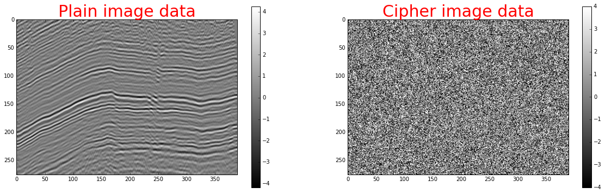

# encryption-52things

This is the code for the Encryption chapter in 52 Things You Should Know About Geocomputing by Graham Ganssle.

---

*Contact [GRAM](https://gra.m-gan.sl) with questions or comments. BTW, [here's GRAMs PGP key](https://pgp.mit.edu/pks/lookup?op=get&search=0x4594E5B8DC292909), you encryption aficionado.*
