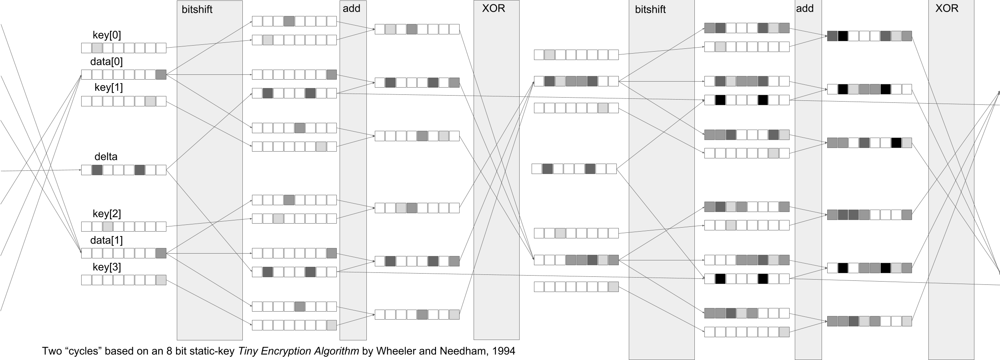

# encryption-52things

This is the code for the Encryption chapter in 52 Things You Should Know About Geocomputing by Graham Ganssle.

Here's my pictoral representation of the [Tiny Encryption Algorithm](http://citeseer.ist.psu.edu/viewdoc/download;jsessionid=C08E8409ADF484095568965A1EBF3E5E?doi=10.1.1.45.281&rep=rep1&type=pdf) by Wheeler and Needham, 1994. This representation would impart a static-key mixing profile with 8 bit word inputs for key and data. In the real deal ([included](encryption.ipynb) in this repo) the input words are full 32 bit floats and the mixing profile is linearly progressive.

---

*Contact [GRAM](https://gra.m-gan.sl) with questions or comments. BTW, [here's GRAMs PGP key](https://pgp.mit.edu/pks/lookup?op=get&search=0x4594E5B8DC292909), you encryption aficionado.*
